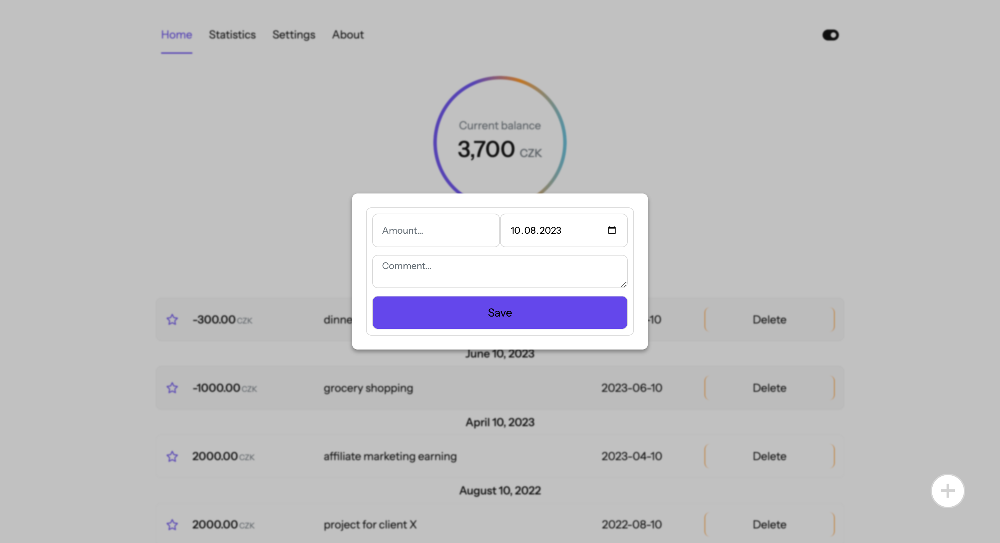

# SimpleBudget

## Overview

SimpleBudget is a React application designed to help users effortlessly track their income and expenses. It offers offline transaction recording, advanced search capabilities, interactive statistics visualization, and priority tagging.

## Features

- **Transaction Tracking:** Record your income and expenses with ease, even when offline.
- **Advanced Search:** Quickly locate specific transactions based on value, date, or comments.
- **Statistics Visualization:** Gain insights into your spending patterns with interactive chart.
- **Priority Tagging:** Highlight and categorize important transactions for easy reference.

## Technologies Used

- React
- Styled Components
- IndexedDB
- Progressive Web App (PWA) architecture

## Live Demo

Check out the live demo [here](https://simplebudgett.netlify.app/).

## Preview

